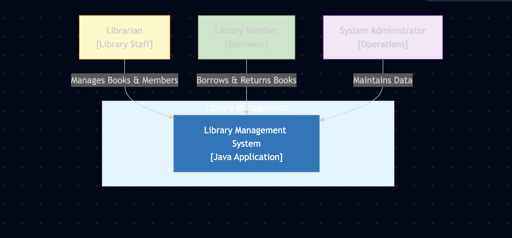
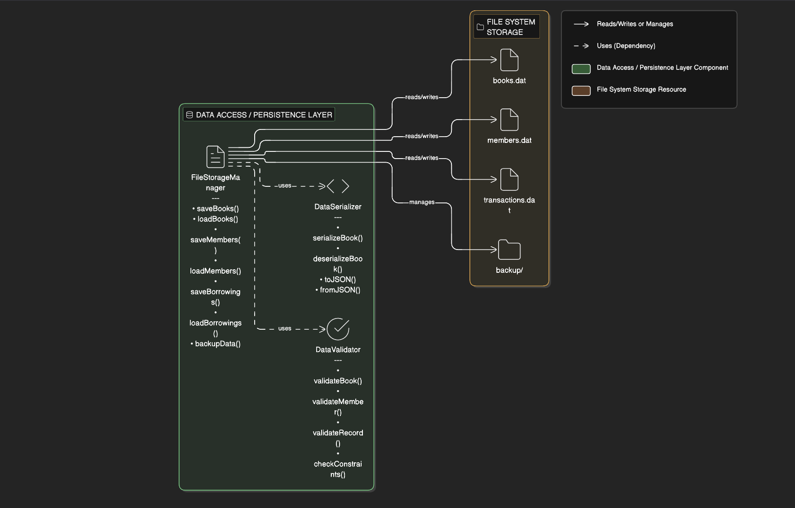

# Library Management System - Architecture Documentation

## 1. Project Overview

**Project Name:** Library Management System

**Domain:** Library Management - Institutions that catalog, organize, and lend information resources (books, journals) to members.

**Problem Statement:** Libraries require a digital system to efficiently manage book inventory, member registrations, borrowing transactions, overdue tracking, and reporting to replace manual paper-based processes.

---

## 2. System Context (C4 Level 1)



The Library Management System operates in a context where multiple user types interact with the system:


### System Actors

| Actor | Role | Interactions |
|-------|------|--------------|
| **Librarian** | Library staff | Manages catalog, processes borrowing/returns, generates reports |
| **Member** | Library patron | Searches books, borrows/returns books, views history |
| **System Admin** | Operations staff | Maintains data, backups, user accounts |

---

## 3. Container Diagram (C4 Level 2)



The system is decomposed into logical containers representing different applications/services:


### Container Details

| Container | Technology | Responsibility |
|-----------|-----------|-----------------|
| **User Interface** | CLI | User interaction, menu navigation, data display |
| **Business Logic** | Java Classes | Core domain logic, rules enforcement, calculations |
| **Data Access Layer** | File I/O | Persistence, serialization, data validation |
| **Data Storage** | File System | Persistent data in text/binary files |

---

## 4. Component Diagram (C4 Level 3)

 Data Access layers:


┌──────────────────────────────────────────────────────────────────┐
│                        CLASS STRUCTURE                           │
└──────────────────────────────────────────────────────────────────┘

                    ┌─────────────────────┐
                    │   LibrarySystem     │
                    │ (Main Application)  │
                    └──────────┬──────────┘
                               │
                ┌──────────────┼──────────────┐
                │              │              │
         ┌──────▼────┐  ┌──────▼────┐  ┌─────▼──────┐
         │BookManager│  │MemberMgr. │  │BorrowingMgr│
         └──────┬────┘  └──────┬────┘  └─────┬──────┘
                │              │              │
                └──────────────┼──────────────┘
                               │
                  ┌────────────▼───────────┐
                  │ FileStorageManager     │
                  │ (Persistence)          │
                  └────────────────────────┘

        DATA STRUCTURES USE
        ─────────────────────

    ┌─────────────────────────┐
    │  ArrayList<Book>        │  - Fast iteration, insertion
    │  HashMap<ISBN, Book>    │  - O(1) lookup by ISBN
    └─────────────────────────┘

    ┌─────────────────────────┐
    │ ArrayList<Member>       │  - Maintain membership list
    │ HashMap<ID, Member>     │  - Quick member lookup
    └─────────────────────────┘

    ┌──────────────────────────┐
    │ ArrayList<BorrowRecord>  │  - Transaction history
    │ TreeMap<Date, Record>    │  - Sort by date
    │ PriorityQueue<Overdue>   │  - Urgent overdues first
    └──────────────────────────┘


            ALGORITHM EXAMPLES
            ──────────────────

    // Binary Search (for sorted lists)
    int findBook(ArrayList<Book> books, String title)

    // Bubble/Quick Sort (for reports)
    void sortByPopularity(ArrayList<Book> books, int[] borrowCount)

    // Date Comparison (for overdue detection)
    boolean isOverdue(LocalDate dueDate)

    // Fine Calculation Algorithm
    double calculateFine(LocalDate dueDate, double dailyRate)


---

## 5. Data Flow Diagram

### Borrowing Transaction Flow

```
  Member              UI            BookManager      BorrowingManager      FileStorage
    │                 │                 │                  │                  │
    │─ Request ────────>                │                  │                  │
    │   to borrow      │                 │                  │                  │
    │                  │─ Search ─────────>                │                  │
    │                  │  ISBN/Title      │                 │                  │
    │                  │<─ Book Found ────│                │                  │
    │                  │                  │                 │                  │
    │                  │─ Check ──────────────────────────>│                  │
    │                  │  Availability    │                 │                  │
    │                  │<─ Available ─────────────────────│                  │
    │                  │                  │                 │                  │
    │                  │─ Create ─────────────────────────>│                  │
    │                  │  Borrow Record   │                 │                  │
    │                  │<─ Transaction ───────────────────│                  │
    │                  │  Recorded        │                 │                  │
    │                  │                  │                 │─ Save ──────────>│
    │                  │                  │                 │  Transaction     │
    │                  │                  │                 │<─ Saved ────────│
    │<─ Confirmation ──│                  │                 │                  │
    │                  │                  │                 │                  │


