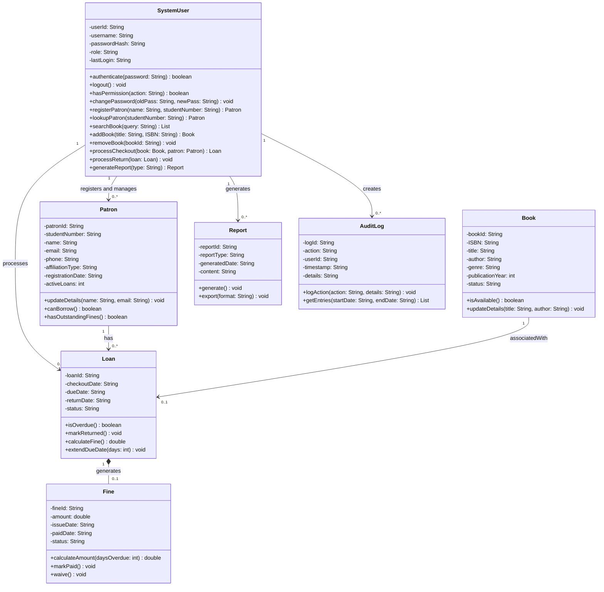

# Domain Model and Class Diagram

## 1. Domain Model

### 1.1 How the System Works

The library operates as a CLI system where **SystemUsers** (Librarians, Head Librarians, etc.) perform all operations on behalf of **Patrons** (students, lecturers, or any university-affiliated person). Patrons do not have system accounts and cannot interact with the CLI directly.

The core flow is:
1. A SystemUser authenticates before any operation can be performed.
2. A Patron comes in and provides their details — the Librarian registers them or looks them up.
3. The Librarian searches the catalog for the requested Book.
4. If available, the Librarian processes a checkout — creating a Loan that links the Book and the Patron.
5. When the Patron returns the book, the Librarian processes the return. If overdue, a Fine is generated.
6. Fines can be paid or waived by authorised users.
7. Head Librarians and University Administrators generate Reports on system activity.
8. Every action is recorded in the AuditLog for accountability.

---

### 1.2 Key Domain Entities

| Entity | Attributes | Methods | Relationships |
|--------|-----------|---------|---------------|
| **SystemUser** | `userId`, `username`, `passwordHash`, `role`, `lastLogin` | `authenticate()`, `logout()`, `hasPermission()`, `changePassword()`, `registerPatron()`, `lookupPatron()`, `searchBook()`, `addBook()`, `removeBook()`, `processCheckout()`, `processReturn()`, `generateReport()` | Registers `Patron`s; processes `Loan`s; generates `Report`s; creates `AuditLog` entries |
| **Patron** | `patronId`, `studentNumber`, `name`, `email`, `phone`, `affiliationType`, `registrationDate`, `activeLoans` | `updateDetails()`, `canBorrow()`, `hasOutstandingFines()` | Has many `Loan`s; may have `Fine`s through Loans |
| **Book** | `bookId`, `ISBN`, `title`, `author`, `genre`, `publicationYear`, `status` | `isAvailable()`, `updateDetails()` | Associated with at most one active `Loan` |
| **Loan** | `loanId`, `checkoutDate`, `dueDate`, `returnDate`, `status` | `isOverdue()`, `markReturned()`, `calculateFine()`, `extendDueDate()` | Links `Book` and `Patron`; may generate a `Fine` |
| **Fine** | `fineId`, `amount`, `issueDate`, `paidDate`, `status` | `calculateAmount()`, `markPaid()`, `waive()` | Belongs to a `Loan` |
| **Report** | `reportId`, `reportType`, `generatedDate`, `content` | `generate()`, `export()` | Generated by authorised `SystemUser` |
| **AuditLog** | `logId`, `action`, `userId`, `timestamp`, `details` | `logAction()`, `getEntries()` | Created by every `SystemUser` action |

---

### 1.3 Relationships Between Entities

- A **SystemUser** registers and looks up **Patron**s on their behalf — Patrons have no system account.
- A **SystemUser** (Librarian) processes a checkout by linking a **Book** and a **Patron**, creating a **Loan**.
- A **Book** can be associated with at most one active **Loan** at a time.
- A **Patron** can have zero or many **Loan**s over time, but no more than 5 active at once.
- A **Loan** may generate at most one **Fine** — modelled as composition (a Fine cannot exist without its Loan).
- Authorised **SystemUser**s (Head Librarian, University Administrator) generate **Report**s.
- Every action performed by a **SystemUser** is recorded as an entry in **AuditLog**.

---

### 1.4 Business Rules

| Rule | Requirement |
|------|-------------|
| A SystemUser must authenticate before performing any operation. | FR11 |
| A Patron must be registered (by a Librarian) before borrowing. | FR1 |
| A Book must have status `AVAILABLE` before it can be checked out. | FR2 |
| A Patron may have a maximum of 5 active loans at any time. | FR3 |
| The default loan period is 14 days. | FR3 |
| A Patron with an unpaid Fine may not borrow additional books. | FR4 |
| Overdue fines are calculated based on the number of days past the due date. | FR4 |
| Only authorised roles (Head Librarian, University Administrator) may generate reports. | FR13, FR14 |
| Every state-changing action is recorded in the AuditLog with a timestamp and user ID. | FR16 |

---

## 2. Class Diagram (Mermaid.js)

---

### 2.1 Key Design Decisions

**SystemUser holds the operational methods** — Because the Librarian drives every action in the system, methods like `processCheckout(book, patron)`, `searchBook()`, and `registerPatron()` belong on `SystemUser`. A Book or Patron cannot act on themselves in a CLI where a Librarian mediates everything.

**Patron is not a SystemUser** — Patrons (students, lecturers, university staff) borrow books but do not log into the system. The Librarian registers them and acts on their behalf. Keeping them as a separate entity with no authentication attributes reflects this correctly.

**`affiliationType` on Patron** — Because borrowers can be students, lecturers, or other university staff, `affiliationType` captures who they are without forcing a rigid subclass hierarchy. A single `Patron` class covers all cases.

**Role-based access on SystemUser** — Rather than creating subclasses for each actor (Librarian, Head Librarian, etc.), a `role` attribute and `hasPermission()` method control what each user can do. This is simpler and practical for a file-based CLI system.

**Composition between Loan and Fine** — A Fine has no meaning outside of a Loan. If the Loan is removed, the Fine goes with it. This is correctly modelled as composition.

**AuditLog carries `userId`** — Since the External Auditor needs to trace who performed which action, each log entry records the `userId` of the SystemUser responsible.
